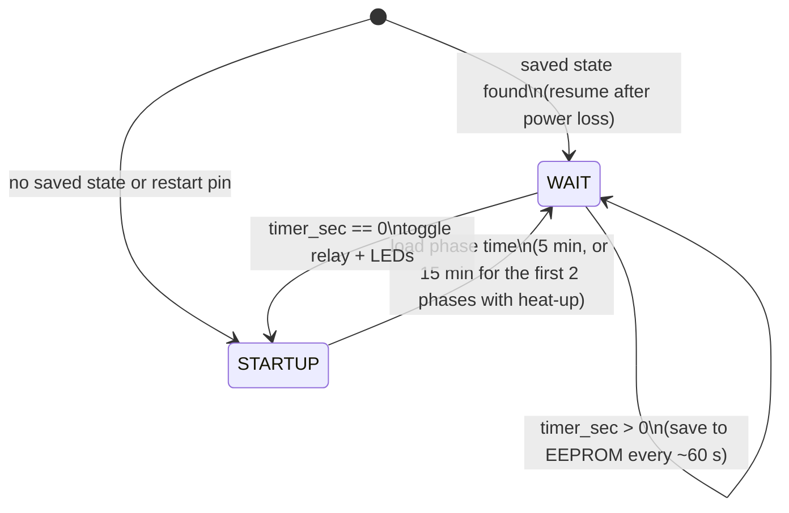

# Shared Socket Cooker Timer

[](https://doi.org/10.5281/zenodo.22991341) [](https://github.com/josto-me/shared-socket-cooker-timer/actions/workflows/build.yml) [](LICENSE) [](LICENSE-CC-BY-4.0.txt) [](CITATION.cff)

Zeitsteuerung für zwei Kochgeräte an einer gemeinsamen Steckdose.

An Arduino timer that shares one 230 V socket between two electric cookers: it switches the
socket back and forth between them, so that both meals get cooked and stay hot.

## Safety and disclaimer

This is a hobby project, not a certified product. It switches 230 V at up to about 2.5 kW:
wrong wiring, an unsuitable relay or an open enclosure can cause electric shock and fire.
Work on mains wiring only if you are qualified and follow the local regulations. Cooking
appliances must not be left unattended; the timer is no protective device. No warranty,
see the licenses.

## The problem

Only **one 230 V socket, good for about 2.5 kW**, is available, but **two meals** have to be
cooked at the same time. Two electric cookers on that one socket would trip the fuse, and
cooking one meal after the other means the first one is cold by the time the second is done.

The solution is a changeover switch with a timer: the socket always feeds **exactly one**
cooker, so the load never exceeds what the socket allows, and the timer swaps between the
two pots often enough that both get cooked and stay hot.

## About

The timer drives a single changeover relay that switches the socket between pot A and
pot B every 5 minutes. Optionally (`HEATUP_ENABLED`), each pot is first heated for
15 minutes before the 5-minute alternation starts. Two status LEDs show which pot is
currently powered: LED A for pot A, LED B for pot B.

**Resume after power loss:** the timer saves the running phase and its remaining time to
the EEPROM about once a minute and carries on where it was when power returns. The saves
rotate through a 64-slot ring buffer so that the EEPROM lasts (about 10 years of continuous
operation). A jumper or button from pin 7 to GND, held while switching on, starts a fresh run.

The controller runs its own `main()` (no Arduino `setup()`/`loop()`) and uses a single 16-bit
timer (Timer3) as time base: one overflow interrupt every ~1.049 s decrements a software
timer, and a small state machine arms and polls it. There are no blocking `delay()` calls.
`timer_sec` is `volatile` and is read and written in `ATOMIC_BLOCK`, because it is a 16-bit
value shared with the ISR.

## Hardware

| | |
|---|---|
| MCU / board | ATmega32U4 (Arduino Leonardo/Micro) or ATmega2560 (Arduino Mega 2560), 16 MHz |
| Time base | Timer3, 16-bit, prescaler 256 → overflow every 1.048576 s |
| Pin 4 | Changeover relay (SPDT): pot A vs. pot B |
| Pin 6 / Pin 5 | Status LED A / LED B (lit while that pot is powered) |
| Pin 7 | Optional: to GND at power-up = start fresh at pot A (internal pull-up) |
| EEPROM | 512 bytes from address 0: ring buffer for the saved state |

Relay driver, contact assignment and LED resistors: [`docs/wiring.md`](docs/wiring.md).

## How it works



The timing and the derivation of the 5- and 15-minute tick constants are in
[`docs/timer-math.md`](docs/timer-math.md).

### Resume after power loss

The running phase (`cycle`) and its remaining time (in ticks) are saved to the EEPROM at
every phase start and then every `TIME_SAVE` = 57 ticks (~59.8 s). At power-up the newest
saved state is loaded and the timer continues in that phase, on the pot that phase belongs
to (odd phase = pot A), with the saved remaining time. At most the last ~60 s of a phase
are repeated. Code: `State_Storage.cpp/.h` (`State_Load`, `State_Save`).

Each save writes one 8-byte record into the next of 64 slots (512 bytes from address 0):

| Byte | Content |
|---|---|
| 0 | marker `0xB5` (erased EEPROM `0xFF` is invalid) |
| 1–2 | sequence number, +1 per save |
| 3–4 | `cycle` (running phase) |
| 5–6 | remaining time in ticks |
| 7 | CRC-8 (CCITT, `_crc8_ccitt_update`) over bytes 0–6, written last |

At power-up all 64 slots are scanned. The newest record is the valid slot whose successor
is invalid or does not carry sequence number +1; this also works across the 16-bit
wraparound of the sequence number. If the power fails in the middle of a save, that slot
fails the CRC check and the record before it is used (at most one minute older).
Brown-out detection (enabled by the stock Arduino fuses) keeps the MCU from writing at too
low a supply voltage. One save takes ~8 × 3.4 ms; the ISR keeps running.

**EEPROM wear.** The ATmega32U4 and ATmega2560 datasheets specify 100,000 write/erase cycles
per EEPROM cell. With ~72 saves per hour (60 per hour + 12 phase starts), a single fixed
cell would last ~1,400 hours (~58 days) of continuous operation. Spread over 64 slots, each
slot is written ~1.1 times per hour, i.e. ~89,000 hours (~10 years) until a cell reaches
its rated endurance. `eeprom_update_block` skips bytes that did not change.

### Limitations

- The timer never switches the cookers off: pin 4 only *selects* pot A or B, so one pot
  is powered whenever the socket is live, also with the relay de-energized or the
  controller off. The cookers are switched off at the socket or at the cookers.
- Uploading a new sketch through the bootloader does not erase the EEPROM. Pin 7 to GND at
  power-up is the way back to phase 1.

## Contents

```
firmware/Shared_Socket_Cooker_Timer/   the sketch
  Shared_Socket_Cooker_Timer.ino       main program: timer, state machine, relay and LEDs
  State_Storage.cpp/.h                 EEPROM ring buffer: save/load phase + remaining time
docs/timer-math.md                     prescaler -> tick -> 5/15-min constants, timing diagram
docs/wiring.md                         SPDT relay + 2 LEDs wiring sketch
docs/porting.md                        Uno/Timer1 port, and the main()-override / USB caveat
```

## Build

- Arduino IDE (or arduino-cli): open `firmware/Shared_Socket_Cooker_Timer/` as a sketch.
  Board: *Arduino Leonardo* / *Arduino Micro* (ATmega32U4) or *Arduino Mega 2560*
  (ATmega2560). CPU clock 16 MHz.
- Options are compile-time `#define`s at the top of the sketch:
  `HEATUP_ENABLED` (0 = 5-min alternation from the start, 1 = heat each pot for 15 min
  first) and `RESUME_ENABLED` (1 = resume after power loss,
  0 = always start at pot A).
- Fuses: stock Arduino bootloader settings.
- **Leonardo/Micro caveat:** the sketch overrides `main()` and does not start USB-CDC, so
  the board does not enumerate as a serial port and needs a **manual reset into the
  bootloader** to re-upload. Details in [`docs/porting.md`](docs/porting.md).

The CI builds the sketch for the Leonardo and the Mega 2560 on every push.

## License

- Code in `firmware/`: **Apache License 2.0**, see [`LICENSE`](LICENSE) and [`NOTICE`](NOTICE).
- `docs/` and the README: **CC BY 4.0**, see [`LICENSE-CC-BY-4.0.txt`](LICENSE-CC-BY-4.0.txt).

You may use, change and share everything, also commercially. When you pass it on or
publish something based on it, credit it as:

> Johannes Stockhammer, "Shared Socket Cooker Timer", version 1.0.0, Zenodo, https://doi.org/10.5281/zenodo.22991342

GitHub shows the same citation under "Cite this repository" (from [`CITATION.cff`](CITATION.cff)).

## Dependencies

Needed to build: Arduino AVR core (LGPL-2.1-or-later) and avr-libc (modified BSD), both installed with the Arduino IDE.

## Trademarks

Arduino and Atmel/AVR are trademarks of their respective owners, used only to identify the hardware.

## Author

Johannes Stockhammer

Concept, hardware and original firmware by Johannes Stockhammer. Translation, code revision, the EEPROM resume function, the optional heat-up phase and the documentation were done with the help of AI tools and reviewed by the author.
